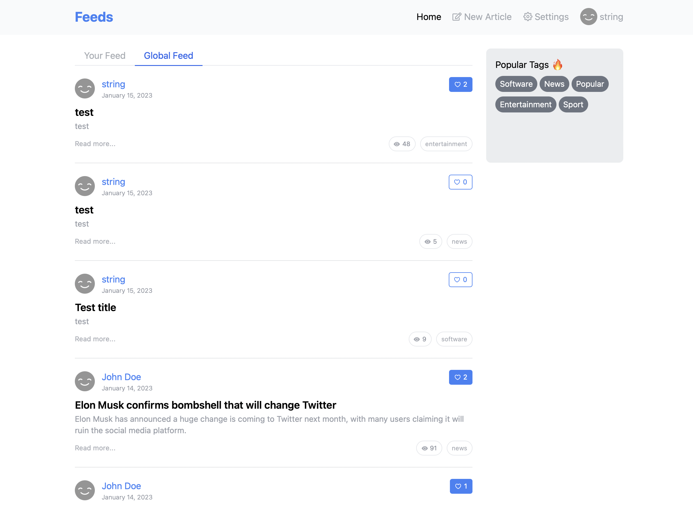
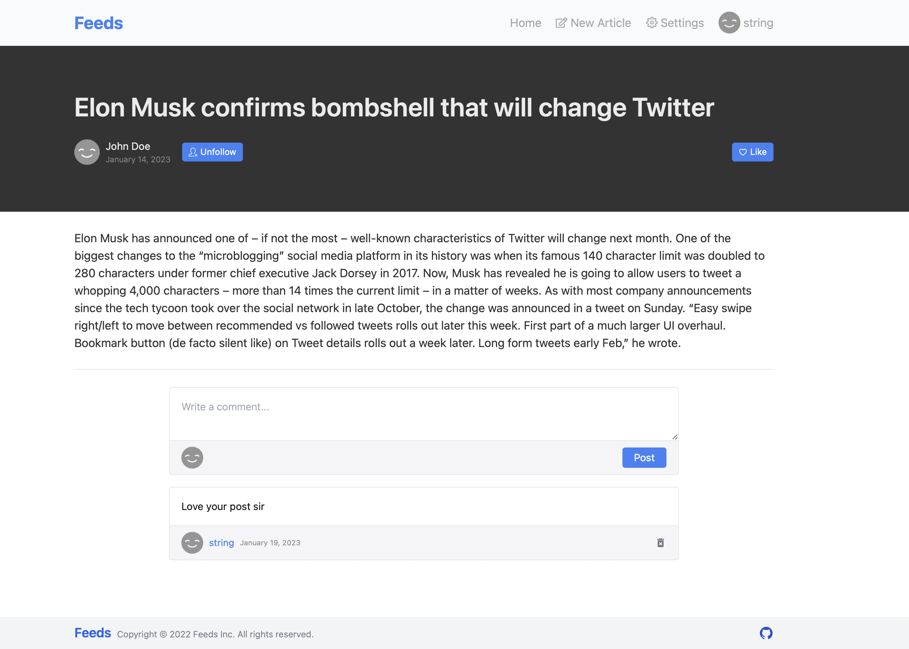
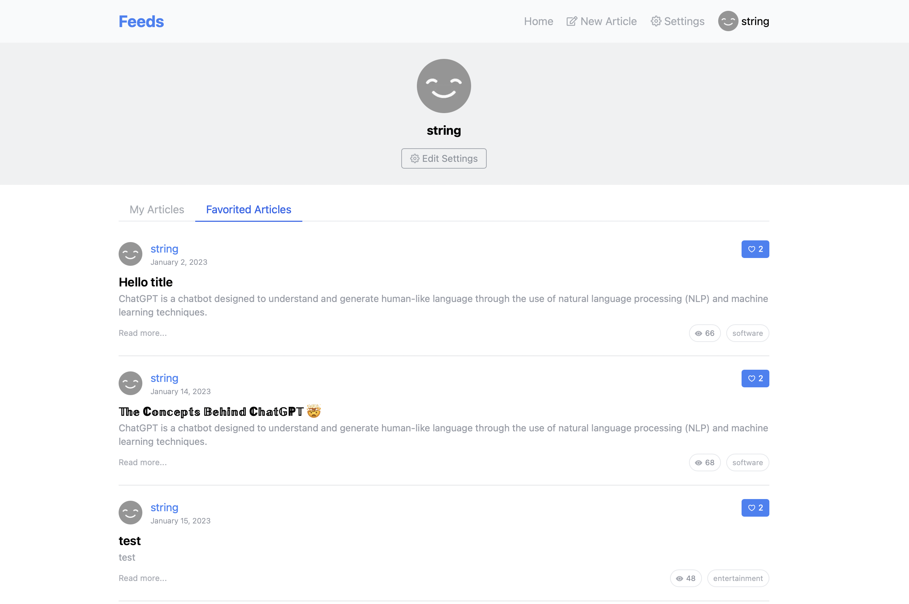

## Feeds

A blogging platform that allows users to share their ideas, insights and experiences with a wider audience on a variety of topics with the features of like, comment and follow the authors utilizing **Microservice Arichitecture**.

Tech Stack: NextJs, NodeJs (Express), .NET Core, Gin (Go), MySQL, MongoDB, PostgreSQL, Docker

Website: https://feeds-nine.vercel.app

| Codebase                                                                                  | Description            |
| ----------------------------------------------------------------------------------------- | ---------------------- |
| [fontend-app](https://github.com/kkaung/MateFlightAdvisor/tree/main/client)               | NextJs Application     |
| [auth&users-api](https://github.com/kkaung/feeds/tree/main/services/auth)                 | NodeJs(Express) Server |
| [tags&articles-api](https://github.com/kkaung/feeds/tree/main/services/articles)          | Golang Server          |
| [comments-api](https://github.com/kkaung/feeds/tree/main/services/comments/FeedsComments) | .NET Core Server       |

## App Previews

- Home Page
  

- Article Page
  

- Profile Page

